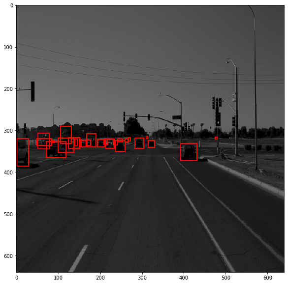

# Object detection in an Urban Environment

## Data

For this project, we will be using data from the [Waymo Open dataset](https://waymo.com/open/). The files can be downloaded directly from the website as tar files or from the [Google Cloud Bucket](https://console.cloud.google.com/storage/browser/waymo_open_dataset_v_1_2_0_individual_files/) as individual tf records. 

## Structure

The data in the classroom workspace will be organized as follows:
```
../backups/
    - raw: contained the tf records in the Waymo Open format. (NOTE: this folder only contains temporary files and should be empty after running the download and process script)

../data/ (outside of the project root - in the docker image => /app/data)
    - processed: contained the tf records in the Tf Object detection api format. (NOTE: this folder should be empty after creating the splits)
    - test: contain the test data
    - train: contain the train data
    - val: contain the val data
```

The experiments folder will be organized as follow:
```
experiments/
    - exporter_main_v2.py: to create an inference model

/model_main_tf2.py: to launch training

training/
    experiment1/....: first experiment
    experiment2/...: second experiment
    pretrained-models/: contains the checkpoints of the pretrained models.
```

## Prerequisites

### Local Setup

For local setup if you have your own Nvidia GPU, you can use the provided Dockerfile and requirements in the [build directory](./build).

Follow [the README therein](./build/README.md) to create a docker container and install all prerequisites.

### Classroom Workspace

In the classroom workspace, every library and package should already be installed in your environment. However, you will need to login to Google Cloud using the following command:
```
gcloud auth login
```
This command will display a link that you need to copy and paste to your web browser. Follow the instructions. You can check if you are logged correctly by running :
```
gsutil ls gs://waymo_open_dataset_v_1_2_0_individual_files/
```
It should display the content of the bucket.

## Instructions

### Download and process the data

The first goal of this project is to download the data from the Waymo's Google Cloud bucket to your local machine. For this project, we only need a subset of the data provided (for example, we do not need to use the Lidar data). Therefore, we are going to download and trim immediately each file. In `download_process.py`, you will need to implement the `create_tf_example` function. This function takes the components of a Waymo Tf record and save them in the Tf Object Detection api format. An example of such function is described [here](https://tensorflow-object-detection-api-tutorial.readthedocs.io/en/latest/training.html#create-tensorflow-records). We are already providing the `label_map.pbtxt` file. 

Once you have coded the function, you can run the script at using
```
python download_process.py --data_dir ../data/ --temp_dir ../backups/
```

You are downloading XX files so be patient! Once the script is done, you can look inside the `../data/processed` folder to see if the files have been downloaded and processed correctly.


### Exploratory Data Analysis

Now that you have downloaded and processed the data, you should explore the dataset! This is the most important task of any machine learning project. To do so, open the `Exploratory Data Analysis` notebook. In this notebook, your first task will be to implement a `display_instances` function to display images and annotations using `matplotlib`. This should be very similar to the function you created during the course. Once you are done, feel free to spend more time exploring the data and report your findings. Report anything relevant about the dataset in the writeup.

Keep in mind that you should refer to this analysis to create the different spits (training, testing and validation). 


### Create the splits

Now you have become one with the data! Congratulations! How will you use this knowledge to create the different splits: training, validation and testing. There are no single answer to this question but you will need to justify your choice in your submission. You will need to implement the `split_data` function in the `create_splits.py` file. Once you have implemented this function, run it using:
```
python create_splits.py --data_dir ../data/
```

NOTE: Keep in mind that your storage is limited. The files should be <ins>moved</ins> and not copied. 

### Edit the config file

Now you are ready for training. As we explain during the course, the Tf Object Detection API relies on **config files**. The config that we will use for this project is `pipeline.config`, which is the config for a SSD Resnet 50 640x640 model. You can learn more about the Single Shot Detector [here](https://arxiv.org/pdf/1512.02325.pdf). 

First, let's download the [pretrained model](http://download.tensorflow.org/models/object_detection/tf2/20200711/ssd_resnet50_v1_fpn_640x640_coco17_tpu-8.tar.gz) and move it to `training/pretrained-models/`. 

Now we need to edit the config files to change the location of the training and validation files, as well as the location of the label_map file, pretrained weights. We also need to adjust the batch size. To do so, run the following:
```
python edit_config.py --train_dir ../data/train/ --eval_dir ../data/val/ --batch_size 4 --checkpoint ./training/pretrained-models/ssd_resnet50_v1_fpn_640x640_coco17_tpu-8/checkpoint/ckpt-0 --label_map label_map.pbtxt
```
A new config file has been created, `pipeline_new.config`.

### Training

You will now launch your very first experiment with the Tensorflow object detection API. Create a folder `training/reference`. Move the `pipeline_new.config` to this folder. You will now have to launch two processes: 
* a training process:
```
python model_main_tf2.py --model_dir=training/reference/ --pipeline_config_path=training/reference/pipeline_new.config
```
* an evaluation process:
```
python model_main_tf2.py --model_dir=training/reference/ --pipeline_config_path=training/reference/pipeline_new.config --checkpoint_dir=training/reference/
```

NOTE: both processes will display some Tensorflow warnings.

To monitor the training, you can launch a tensorboard instance by running `tensorboard --logdir=training`. You will report your findings in the writeup. 

### Improve the performances

Most likely, this initial experiment did not yield optimal results. However, you can make multiple changes to the config file to improve this model. One obvious change consists in improving the data augmentation strategy. The [`preprocessor.proto`](https://github.com/tensorflow/models/blob/master/research/object_detection/protos/preprocessor.proto) file contains the different data augmentation method available in the Tf Object Detection API. To help you visualize these augmentations, we are providing a notebook: `Explore augmentations.ipynb`. Using this notebook, try different data augmentation combinations and select the one you think is optimal for our dataset. Justify your choices in the writeup. 

Keep in mind that the following are also available:
* experiment with the optimizer: type of optimizer, learning rate, scheduler etc
* experiment with the architecture. The Tf Object Detection API [model zoo](https://github.com/tensorflow/models/blob/master/research/object_detection/g3doc/tf2_detection_zoo.md) offers many architectures. Keep in mind that the `pipeline.config` file is unique for each architecture and you will have to edit it. 


### Creating an animation
#### Export the trained model
Modify the arguments of the following function to adjust it to your models:
```
python .\exporter_main_v2.py --input_type image_tensor --pipeline_config_path training/experiment0/pipeline.config --trained_checkpoint_dir training/experiment0/ckpt-50 --output_directory training/experiment0/exported_model/
```

Finally, you can create a video of your model's inferences for any tf record file. To do so, run the following command (modify it to your files):
```
python inference_video.py -labelmap_path label_map.pbtxt --model_path training/experiment0/exported_model/saved_model --tf_record_path ../data/test/tf.record --config_path training/experiment0/pipeline_new.config --output_path animation.gif
```

## Submission Template

### Project overview
This section should contain a brief description of the project and what we are trying to achieve. Why is object detection such an important component of self driving car systems?

### Set up
This section should contain a brief description of the steps to follow to run the code for this repository.

### Dataset
#### Dataset analysis

The datasets contains several batches of images that contains (or not) annotated objects. The three classes are cars (1), pedestrians (2) and cyclists (4).

In order to provide a better train-test-validation test splits, it is of interest to understand the data into consideration.

One key aspect to understand the data is to understand in which environments and weather conditions are involved. As well, what sort of "sub-classes"are involved into each of the aforementioned classes. Mostly interesting, there  needs to be some variation in all the sets, so that the trained DNN will be able to present better extrapolation on the test and validation sets. 

I randomly selected 10 images from the sets to further investigate the dataset:

 


As seen in the images there are several different scenarios and environments for the input datasets. Housing areas, highways, night time, commercial areas, trucks, suvs, small and large vehicles, pedestrians and vehicles in a mix.

After sampling 32768 random images from the inputs we obtain the following distribution graph (violin):


This shows how imbalanced the classes are spread throughout the different dataset images. Cars happen the most in average and in number. Followed by pedestrians whose averages is much smaller than that of cars and by cyclists. The largest distribution for cyclist is in 0 as seen in the chart. 

All of these visualizations and more are contained in the `Exploratory Data Analysis.ipynb` file.

**Distributions**

The following graph represents the distributions of classes according to the number of objects (removed images where the number of cyclists are 0 to make it more meaningful):


Which is complemented by the following dataframe.describe() table:


Both taken into account there are 50% of images with 16 or more cars. On the other hand half of the images have no pedestrian whatsoever and even less images have cyclists. Just 3758 of the 32768 images have cyclists (11.47%). And the maximum and mean number of cyclists per image is much smaller in comparison to that of pedestrians and cars.

#### Cross validation

The datasets are downloaded using the `download_process.py` script and consists of 100 record waymo files. They are split into train-validation-test sets, split into 75, 15 and 10 percent of the data, respectively. These are split physically in different folders (in `create_splits.py`) randomly. That ensures that the train-validation-test sets will be different every time this script is ran (as the random seed is not set for the script). This random shuffle increases the randomness of the selection and the probability that the classes will be better mixed into each split. 

The 75, 15 10 split is given in order to minimize overfitting and test error, increasing so the overall explotation capabilities of the trained model. 

### Training 
#### Reference experiment

The training were performed on GPU with 4 CUDA cores and hence a batch size of 4 was selected to optimize core usage (checked with nvtop tool). The evaluation process was run on all available CPUs, in order to avoid the GPU runnning out of memory (only 6GB available in my computer). I first of all ran the training and validation based on the configurations without augmentation of the Restnet50 [pretrained model](http://download.tensorflow.org/models/object_detection/tf2/20200711/ssd_resnet50_v1_fpn_640x640_coco17_tpu-8.tar.gz) which yielded the following results:

**Training Loss**


The loss, precision and recall charts are shown above and the inference from these are:
* Overfitting is happening
* Does not generalize well
* Precision is low
* Recall is high
* Precision and recall are **very slowly** increasing

In general the model could be much better. For this purpose, I tested some augmentation options in the training sets:


Bright due to Sunlight Problems


Bright and poor contrast


Grayscale Images


Dark with contrast


Dark with poor contrast

#### Improve on the reference

I've conducted two experiments one just adding augmentations and keeping the learning rate and other parameters (`training/experiment1`) and other providing both more aggressive augmentations and training parameters (`training/experiment2`) get the the following charts below after training the model with the new augmentations.

Example changes in the experiment 1 and 2 configurations:
```json
...
data_augmentation_options {
    random_crop_image {
      min_object_covered: 0.0
      min_aspect_ratio: 0.75
      max_aspect_ratio: 3.0
      min_area: 0.75
      max_area: 1.0
      overlap_thresh: 0.0
    }
  }
  data_augmentation_options {
    random_rgb_to_gray {
      probability: 0.4
    }
  }
  data_augmentation_options {
    random_adjust_contrast {
      min_delta: 0.8
      max_delta: 1.0
    }
  }
  data_augmentation_options {
    random_adjust_brightness {
      max_delta: 0.4
    }
  }
  data_augmentation_options {
    random_horizontal_flip {
    }
  }
  ...
```
These augment options provide a higher random variation of the inputs which should decrease overfitting and improve the algorithm overall extrapolation for the evaluation sets.


The training losses are radically different. Brown is the `experiment2`, pink is the `experiment1` and orange the `reference`. Final losses are still quite high in all cases


Precisions comparison


Recalls comparison

Generally, the original model presents itself as a good average one but the racall rate of the `experiment2` is consistently smaller then the other two. The precision in `experiment1` is higher than `reference` for the most cases while presenting better recall rates, especially for small ARs. In general, the recall rates and precision are increasing over time. This indicates that even though these two experiments are an interesting improvement over the original they unfortunately still are not really good models for the general case. 

The following cases observed in the animation are quite hard on the algorithm and human annotators alike:
* Distant object recognition (too little data for inference)
* Partial occlusion of objects
* Sudden changes in object concentration

The final model videos for the reference, experiment 1 and 2 are in the [animation folder](./animation)

These videos where generated by exporting the models and running:

```
python3 experiments/exporter_main_v2.py --input_type image_tensor --pipeline_config_path training/reference/pipeline_new.config --trained_checkpoint_dir training/reference --output_directory training/reference/exported_model/

python3 inference_video.py --labelmap_path label_map.pbtxt --model_path training/reference/exported_model/saved_model --tf_record_path ../data/processed/test/segment-1172406780360799916_1660_000_1680_000_with_camera_labels.tfrecord --config_path training/reference/pipeline_new.config --output_path animation/reference.gif

python3 experiments/exporter_main_v2.py --input_type image_tensor --pipeline_config_path training/experiment1/pipeline_new.config --trained_checkpoint_dir training/experiment1 --output_directory training/experiment1/exported_model/

python3 inference_video.py --labelmap_path label_map.pbtxt --model_path training/experiment1/exported_model/saved_model --tf_record_path ../data/processed/test/segment-1172406780360799916_1660_000_1680_000_with_camera_labels.tfrecord --config_path training/experiment1/pipeline_new.config --output_path animation/experiment1.gif

python3 experiments/exporter_main_v2.py --input_type image_tensor --pipeline_config_path training/experiment2/pipeline_new.config --trained_checkpoint_dir training/experiment2 --output_directory training/experiment2/exported_model/

python3 inference_video.py --labelmap_path label_map.pbtxt --model_path training/experiment2/exported_model/saved_model --tf_record_path ../data/processed/test/segment-1172406780360799916_1660_000_1680_000_with_camera_labels.tfrecord --config_path training/experiment2/pipeline_new.config --output_path animation/experiment2.gif
```

## Project Instructions

**Building the docker image**
```
docker build -t project-dev -f Dockerfile.gpu .
```

**Running the docker image**
From the project root run:
```
docker run --runtime=nvidia -ti -v $(pwd):/app/project/ -v $(pwd)/../data:/app/data --network=host --shm-size=16gb project-dev bash
```

**PEP8 checks**
[noxfile](noxfile.py) included for checking code standards compliance:

```
nox s lint-3.8 (3.X must correspond the python version)
```

will run flake8 checks on the codebase.